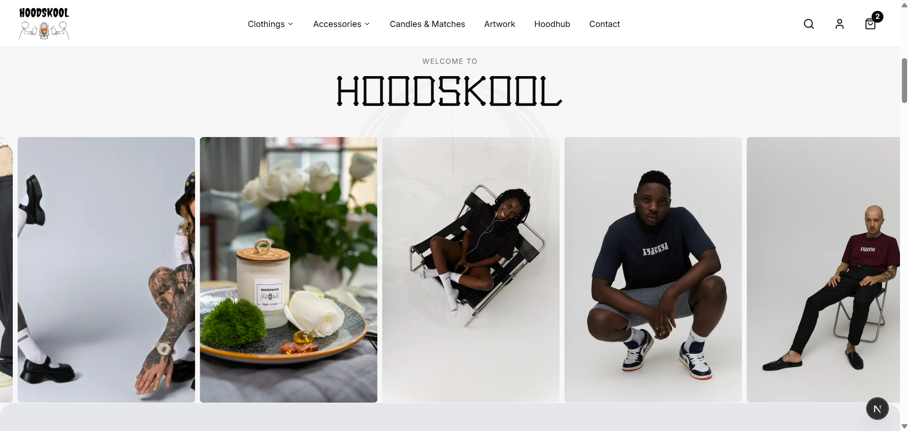

# Hoodskool — Urban Streetwear E-Commerce

> A full-stack e-commerce platform for an urban streetwear brand — featuring product catalog, shopping cart, checkout, wishlists, product reviews, inventory tracking, admin dashboard, and order management.

**Live:** [hoodskool](https://hoodskool.vercel.app)

---

## Screenshots

### Storefront

*Product categories: Clothing, Accessories, Candles & Matches, and Artwork*

---

## What This Is

Hoodskool is the e-commerce arm of the Hood brand. It's a complete online store that I built from the ground up — not a Shopify template, not a WordPress plugin. Every piece of the shopping experience, from product browsing to checkout to order tracking, is custom-built.

The store sells streetwear clothing, accessories, candles & matches, and artwork — all under the Hood brand identity with the signature skull logo.

## Key Features

### Product Catalog with Categories
Dynamic product pages with category filtering (`/categories/[...slug]`), product detail views (`/product/[slug]`), search functionality, and size/variant selection. Products are organized across Clothing, Accessories, Candles & Matches, and Artwork.

### Shopping Cart & Checkout
Full cart management with quantity updates, size selection, and a multi-step checkout flow. Cart state persists across sessions using React context and hooks.

### Admin Dashboard
Protected admin panel for managing products (CRUD), processing orders, updating inventory, and tracking sales. Includes category management for organizing the catalog.

### Authentication System
Customer accounts with registration, login, and order history. Separate admin authentication with role-based access control for the dashboard.

### Wishlist
Customers can save products to a personal wishlist for later. Wishlist state persists across sessions, letting users curate items before committing to a purchase.

### Product Reviews
Customers can rate and review purchased products. Reviews display on product pages with ratings, helping future buyers make informed decisions and building social proof for the brand.

### Inventory Tracking
Real-time stock management across all product variants (sizes, colors). The admin dashboard shows stock levels, and products display availability status to customers — preventing overselling and improving the shopping experience.

### Order Management
Complete order lifecycle — from cart to checkout to order confirmation. Email notifications for order confirmations and status updates.

## Tech Stack

| Layer | Technology |
|-------|-----------|
| **Framework** | Next.js 14 (App Router) |
| **Styling** | TailwindCSS |
| **Language** | TypeScript |
| **State** | React Context + Custom Hooks |
| **Auth** | Custom authentication system |
| **Email** | Transactional order confirmations |
| **UI Components** | shadcn/ui (components.json) |
| **Deployment** | Vercel |

## Architecture

```
app/
├── admin/           # Admin dashboard (products, orders, categories)
├── api/             # API routes (products, orders, auth)
├── auth/            # Login, register, password reset
├── categories/      # Category browsing ([...slug] catch-all)
├── checkout/        # Multi-step checkout flow
├── contact/         # Contact page
├── dashboard/       # Customer dashboard (order history)
├── product/         # Product detail pages ([slug])
├── fonts/           # Custom brand typography
components/          # Shared UI components
constants/           # Store configuration
contexts/            # React context providers (cart, auth)
emails/              # Email templates (order confirmation)
hooks/               # Custom React hooks
types/               # TypeScript type definitions
lib/                 # Utility functions
```

## Technical Decisions

**Why custom e-commerce over Shopify?** The Hood brand needed complete design control and zero platform fees. A custom solution means every pixel matches the brand identity, and there's no monthly subscription eating into margins.

**Why React Context over Redux?** For an e-commerce cart with moderate complexity, Context + custom hooks provides clean state management without the boilerplate. The cart, auth, and product state are isolated in their own providers.

**Why catch-all routes for categories?** The `[...slug]` pattern lets categories nest infinitely — `/categories/clothing/hoodies/oversized` all works without additional route configuration.

## What I'd Improve

- **Add Paystack/Stripe payment integration** — complete the payment flow
- **Implement low-stock alerts** — automated notifications when inventory drops below thresholds
- **Add review moderation** — admin tools for approving/flagging user reviews
- **Build a recommendation engine** — "customers also bought" suggestions based on purchase history

---

**Built by [Abdurrahman Idris](https://abdurrahmanidris.com)** — Full Stack Developer
